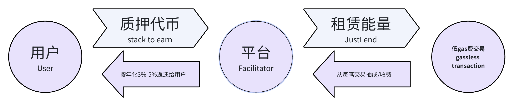

<h1 align="center">TFx402</h1>

<p align="center">
<strong style="font-size: 18px;">Gasless</strong> • <strong style="font-size: 18px;">Secure</strong> • <strong style="font-size: 18px;">Profitable</strong>
</p>

<p>
  基于 Tron 的 AI Agent 智能 facilitator，支持 x402 协议，主打低手续费转账、严格资金安全管控与可靠实时处理。
</p>

## 项目亮点

- Tron 低手续费
- 原生支持 x402
- 多策略资金安全
- 实时支付处理
- 可审计的交易历史
- 闲置资金质押增益

## 技术亮点

- 高频聚合：批量打包压缩成本，simulateValidate 链上验证资金有效，乐观验证提升实时性
- 风控策略：多策略配置，支持小额免密
- 质押收益：年化 3%-5%，Justlend 租赁 Energy 降本，合约锁定保障

## 对比

| 功能 | Tron 原生 | Coinbase x402 | TFx402 |
|------|-----------|--------------|--------|
| 交易手续费 | 约 6.4 – 13.74 TRX（≈ 1.92 – 4.12 USD，按 TRX ≈ 0.3 USD 计算） | 0.001 美金/笔 | 低手续费 |
| USDT 转账 | 标准 | 不支持 | 支持 |
| 处理速度 | 标准 | 快速 | 高频聚合实时处理 |
| 资金安全 | 基础保障 | 标准风控 | 严格多策略风控 |
| 协议支持 | - | x402 | x402 |
| 闲置资金收益 | 无 | 无 | 3%-5% 年化质押增益 |
| 交易验证 | 单笔验证 | 单笔验证 | 链上批量模拟验证 |

## 快速开始

### 前端

```bash
npm install tron-x402
cd front-end
npm run dev
```

### 后端

```bash
cd back-end
npm install
npm run dev
```

### 合约

```bash
cd contract
tronbox compile
tronbox migrate --network nile
```

## domo
### Server Side
```javascript
import { server } from 'tron-x402';

const { x402Gate } = server;

const SELLER_ADDRESS = 'TUzz9HKrE5sgzn5RmGKG35caEyqvawoKga';//收款方
const RESOURCE_PRICE = 1;

app.get(
	'/premium-data',
	x402Gate({
		recipient: SELLER_ADDRESS,
		price: RESOURCE_PRICE,
		asset: 'USDT',
		network: 'tron:0x2b6653dc',
        facilitator_url: 'xxxxxxx',//smart facilitator地址
	}),
	(req, res) => {
		console.log('【test info】', req.payment);
		console.log(`[Success] Payment verified for Invoice: ${req.payment.invoiceId}`);
		res.json({
			status: 'success',
			data: '这里是价值 1 USDT 的核心付费数据...',
			receipt: {
				txId: req.payment.txId,
				from: req.payment.from,
				invoiceId: req.payment.invoiceId,
				amount: req.payment.value,
			},
		});
	}
```

### Client Side
```javascript
import { client } from 'tron-x402';
const { PaymentAgent } = client

const agent = new PaymentAgent({
    privateKey: BUYER_PRIVATE_KEY,
    policyName: 'AutoGPT-shopping', // 比如：基础用户策略、VIP策略、测试策略
    maxBudget: 5000000,
    network: 'nile', // 或 'nile' 测试网
    facilitatorUrl: 'xxxxxx', // Facilitator 服务地址
});

const response = await agent.get(SERVER_URL);// 请求的接口地址
```

## 系统架构


```bash
以上红色部分，是基于标准x402协议，新增的环节
1️⃣风控验证 2️⃣交易聚合
风控验证：基于配置的策略，判断交易是否可放行，可设置不同的策略组，灵活配置
交易聚合流程图如下⬇️
```

```bash
高频交易系统的思路来源于L2的技术，模拟实现了聚合器，打包器，验证器
基于乐观的方式确认交易，用户体感上实时性强，验证器和上链操作的时间窗口很短，降低了多花的可能性。
```

```bash
利用用户的闲散资金，提升整个系统的Energy供给量，降低了上链成本。
增加用户的粘性，更愿意停留在此平台
且平台还可以往Energy出租方面拓展，产生更多的收益
```